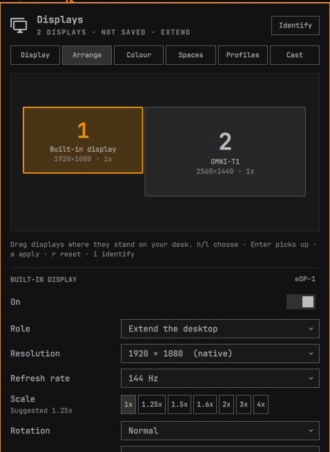

# OmniDisplay

Every display setting in one Omarchy bar widget: arrange your screens by
dragging them, pick resolution, refresh rate, scale and rotation, mirror or
extend, turn HDR on, set brightness on every monitor, save a profile per desk
that comes back by itself when you plug in, plan your workspaces, cast to a TV
and use a tablet as a second screen.

Every change goes live first and is kept only when you say so. If you don't,
or the change takes your screen (or the whole shell) down, it reverts on its
own.



OmniDisplay replaces Omarchy's built-in **Display** widget, so it sits where
that one was and opens with `SUPER + CTRL + D`. Disable it and the built-in
widget comes back.

## Features

| Tab | What it does |
|---|---|
| **Display** | Brightness for every display (laptop backlight, Apple displays and external monitors over DDC/CI, through Omarchy's own brightness command), text size, per-terminal font sizes, scale presets for one display or all of them, laptop modes (Extend, Mirror, External only, Built-in only), turning displays on and off, night light, presentation mode |
| **Arrange** | Drag-and-drop arrangement for any number of displays, snapping flush to the nearest edge; place a display left of, right of, above or below another, aligned at the start, centre or end; resolution, refresh rate, custom modes, clean scales with a suggestion from the panel's pixel density, all eight rotations and flips, mirror one display while extending onto others, adaptive sync; insights such as "not at native resolution" or "limited by the connection" with a one-click fix; make, model, serial, size, density, all click-to-copy |
| **Colour** | Colour presets including HDR, 8 or 10-bit, SDR brightness and saturation in HDR, an ICC profile, what the panel's EDID says it can do; contrast and input source over DDC/CI; for all displays: default adaptive sync, tearing, direct scan-out, automatic HDR |
| **Spaces** | Workspace planner: sequential (1–3, 4–6…), interleaved (odd/even), manual, or off |
| **Profiles** | One profile per set of displays (the desk, the office, the projector), found again by the panels themselves, so a cable moving to another port or dock still matches; switched to automatically, also after resume; a new set can start from the profile it shares most displays with; backups of `monitors.lua` with restore; cleanup of what other display plugins left behind; a diagnostic report |
| **Cast** | Miracast and AirPlay displays, mirroring or extending; a tablet or phone as a screen over VNC; show one window on a cast or tablet screen |

And on every screen: **Identify** (a big number per screen, matching the
tiles) and the **Keep these display settings?** card.

## Requirements and dependencies

- Omarchy 4 (Quattro) with the Quickshell-based `omarchy-shell`.
- Hyprland 0.56 or newer with the Lua config (`~/.config/hypr/hyprland.lua`):
  changes are applied with `hyprctl eval`.
- `bash`, `jq`, `hyprctl`: present on every Omarchy install.

Optional, each feature says so when its tool is missing:

| Tool | For |
|---|---|
| `edid-decode` (package `v4l-utils`) | HDR and VRR capabilities, native-mode insights |
| `ddcutil` | External monitor contrast and input source (brightness works through Omarchy either way) |
| `luac` (package `lua`) | Checking the new `monitors.lua` parses before it replaces the old one |
| `hyprsunset` | Night light (installed by Omarchy) |
| `waycast-bin`, `doubletake-alchemy-bin` (AUR) | Miracast and AirPlay casting |
| `wayvnc`, `qrencode`, `openssl` | Tablets and phones as screens |

No elevated privileges, no system services, no network access of its own
(casting and VNC talk to the devices you choose).

## Install

```bash
omarchy plugin add https://github.com/gameticharles/omnidisplay.git --enable
```

`--enable` puts it in place of the built-in Display widget. If another
plugin that replaces the Display widget is enabled (Display with Monitor
Layout, for example), disable that one first, or the two will both try to
own your layout:

```bash
omarchy plugin disable monitor-layout
```

## Usage

Click the display icon in the bar, or press `SUPER + CTRL + D`.

- **Change something**, then press **Apply** (Arrange, Colour and Spaces
  tabs) or just click it (scale, laptop mode and on/off on the Display tab).
  The change goes live and a card asks **Keep these display settings?** on
  every screen. Press **Keep** (or `K`) to keep it. **Revert** is
  preselected, so `Enter` on a screen you can't read brings the old settings
  back; so does doing nothing for 15 seconds.
- **Kept changes are remembered** as the profile for the displays that are
  connected, and come back whenever that set is plugged in again.

Keys in the panel:

| Key | Does |
|---|---|
| `1`–`6`, `[` `]` | Switch tabs |
| `i` | Identify |
| `j` / `k` | Scroll |
| Arrange: `h` / `l` | Choose a display |
| Arrange: `Enter` | Pick the display up / put it down |
| Arrange: `+` `-` / `o` / `e` | Step the scale / rotate a quarter turn / turn on or off |
| Arrange: `h` `j` `k` `l` while picked up | Move it 100 px (`H` `J` `K` `L`: 10 px) |
| `a` / `r` | Apply / reset |
| Arrange: `p` | Show the exact plan (Lua to apply, how it reverts, what is saved) |
| `Esc` | Close |

### From the terminal or a key binding

```bash
omarchy-shell omnidisplay show arrange      # open on a tab
omarchy-shell omnidisplay cycleMode         # Extend → Mirror → External only → Built-in only
omarchy-shell omnidisplay mode external-only
omarchy-shell omnidisplay profile "Desk"
omarchy-shell omnidisplay scale DP-2 1.5
omarchy-shell omnidisplay rotate DP-2 1     # 0-7, as Hyprland's transform
omarchy-shell omnidisplay setMode DP-2 2560x1440@144
omarchy-shell omnidisplay disable HDMI-A-1
omarchy-shell omnidisplay option general.allow_tearing true   # misc.vrr, render.direct_scanout, render.cm_auto_hdr
omarchy-shell omnidisplay resendHdr         # after a panel drops out of HDR
omarchy-shell omnidisplay keep              # or: revert
omarchy-shell omnidisplay emergency         # revert, or undo the last kept change
omarchy-shell omnidisplay identify
omarchy-shell omnidisplay state             # JSON
```

Each of these goes through the same keep-or-revert countdown as the panel.

Suggested bindings for `~/.config/hypr/bindings.lua` (nothing is bound for
you):

```lua
o.bind("SUPER + P", "Display mode", "omarchy-shell omnidisplay cycleMode")
o.bind("SUPER + CTRL + SHIFT + D", "Undo display change", "omarchy-shell omnidisplay emergency")
```

## Configure

Bar placement: `omarchy bar move omnidisplay --section right`.

Settings live on the widget's entry in `~/.config/omarchy/shell.json` and in
Omarchy's widget settings:

| Setting | Default | Meaning |
|---|---|---|
| `barLabel` | `none` | Text beside the icon: `count`, `profile` or `cast` |
| `confirmSeconds` | `15` | Seconds to keep a change before it reverts |
| `persistMode` | `block+service` | `block+service` writes the managed block in `monitors.lua` (right from boot) and restores profiles on hotplug; `service-only` never edits `monitors.lua` |
| `autoProfiles` | `true` | Apply the profile for the connected displays on hotplug and config reloads |
| `backupsKept` | `10` | `monitors.lua` backups kept |
| `snapThreshold` | `48` | Snapping distance on the canvas, logical px |
| `identifyOnOpen` | `false` | Identify the screens when the panel opens |
| `ddc` | `true` | Use `ddcutil` for contrast and input source |
| `showColor`, `showCast` | `true` | Show those tabs |
| `presentationMode` | `false` | Keep the screen awake and notifications quiet while casting or mirroring |
| `notifications` | `true` | Say when an unknown set of displays is connected or the watchdog reverted |
| `terminalFontOverrides` | `false` | Per-terminal font size rows under Text size |

Files:

| Path | What |
|---|---|
| `~/.config/hypr/monitors.lua` | One block between `-- omnidisplay: begin` and `-- omnidisplay: end`, at the end. Everything outside it is left byte for byte |
| `~/.config/hypr/monitors.lua.omnidisplay.<time>` | Backups, newest `backupsKept` |
| `~/.config/omarchy/omnidisplay/profiles.json` | Profiles. Hand-editable; the panel follows changes |
| `~/.config/omarchy/omnidisplay/vnc/` | VNC password and TLS certificate (owner-only) |
| `$XDG_RUNTIME_DIR/omnidisplay/` | Watchdog tokens (owner-only), cast and VNC state |

## Remove

```bash
omarchy plugin remove omnidisplay
```

The built-in Display widget comes back. Your layout stays as it is, because
the managed block stays in `monitors.lua`. To drop that too, delete the block
(or restore a backup from the Profiles tab first), and optionally:

```bash
rm -rf ~/.config/omarchy/omnidisplay
rm -f ~/.config/hypr/monitors.lua.omnidisplay.*
hyprctl reload
```

### Window, screen or region on a TV

Both cast backends ask the screen-sharing portal for whole screens only, so
a cast shows a screen: in Mirror mode the one you pick, in Extend mode a new
screen made for the TV. To show **one window**, cast in Extend mode (or start
a tablet session showing a new screen), then pick the window under **Show one
window** on the Cast tab: it moves there and fills the screen, and **Return**
puts it back. Sharing in apps (browsers, Zoom, Meet) is not affected by any
of this: those ask for windows and regions themselves.

## How it works

**Apply** builds a plan first: the Lua rules, the revert, and the new
`monitors.lua`, all shown under **Preview**. It refuses overlapping
displays, unclean scales, modes a display does not offer, broken mirrors
and turning off the last display. Then it starts a small detached watchdog,
and only then applies the rules with `hyprctl eval`. If Hyprland refuses or
rounds a setting, the change reverts at once with a message.

**Revert** is `hyprctl reload` (everything `monitors.lua` sets: adaptive
sync, colour, depth), followed by the rules captured just before the change,
so the exact previous mode, position, scale and rotation come back, even
for state that never came from the file. Hyprland can land a reload's rules
after the snapshot, so the snapshot is applied again until the displays
show the state from before. The snapshot itself is read fresh at Apply. The watchdog runs in its own
session, so it reverts even if the change took the shell down.

**Keep** saves the profile, then writes the block after a timestamped backup:
to a private temp file next to `monitors.lua`, checked with `luac`, renamed
over the old one. It refuses when the file changed since it was read; you
can then keep the change live without saving, or revert. Displays are
written by panel (`desc:Make Model Serial`) when that singles one out,
reusing a selector your own rules already use.

**Profiles** are restored by the service on hotplug and config reloads,
without a countdown (they were confirmed when kept), and at most twice in a
row if Hyprland keeps refusing something.

## Moving from other display plugins

The Profiles tab lists what other display plugins left in `monitors.lua`
(loose `hl.monitor` lines, their marked blocks) and folds them into
OmniDisplay's block after a backup. Then disable the old plugins:

```bash
omarchy plugin disable better.displays
omarchy plugin disable azterisk.display-manager
omarchy plugin disable io.github.stevederico.omarchy-displays
omarchy plugin disable omarchy-wireless-display   # its features are on the Cast tab
```

## Troubleshooting

- **A change left me without a usable screen.** Wait: it reverts on its own.
  From a terminal or SSH: `omarchy-shell omnidisplay emergency`, or
  `hyprctl reload`.
- **The panel says the service is not running.** `omarchy restart shell`.
- **External brightness does nothing.** Omarchy's brightness command uses
  DDC/CI there: turn DDC/CI on in the monitor's own menu, and check
  `ddcutil detect`.
- **No HDR presets.** The panel's EDID does not report HDR, or
  `edid-decode` is missing (the Colour tab says which).
- Copy a **diagnostic report** (serial numbers removed) from the Profiles
  tab for an issue. Shell logs: `/run/user/$UID/quickshell/by-id/*/log.log`.

## Development

```bash
scripts/check.sh              # unit tests, control-script tests, manifest, qmllint
bash tests/live.sh            # the engine against the running session, on a virtual output
bash tests/live.sh --restart  # also restarts the shell mid-countdown (the bar blinks)
scripts/check.sh --quick      # unit tests only
scripts/dev-sync.sh --enable  # copy into ~/.config/omarchy/plugins and restart the shell
```

The logic is in `lib/*.js` (plain functions, tested with Node); the control
scripts in `bin/` are tested against a stub `hyprctl` in a temporary home.
See [docs/ARCHITECTURE.md](docs/ARCHITECTURE.md) and
[docs/SECURITY.md](docs/SECURITY.md).

## Credits

OmniDisplay brings together ideas and code from Omarchy's Display widget,
Steve Derico's Displays, Krzysztof Golab Magalhaes' Display with Monitor
Layout, Filippo Veneri's Wireless Display, nightdevil00's Better Displays and
Azteriisk's Display Manager, all MIT. See [NOTICE](NOTICE).

## License

[MIT](LICENSE)
